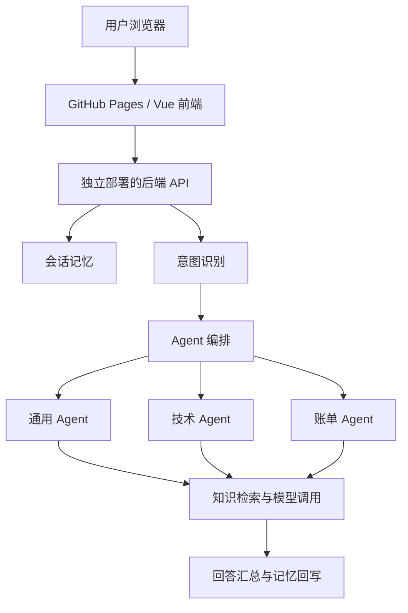

# ServicePilot

基于多 Agent 编排与 RAG 的智能客服系统，支持订单咨询、
技术支持、账单售后、多轮会话记忆及对话质量评测。

- 在线演示：https://kimberly-wilson.github.io/ServicePilot/
- Python 后端说明：[查看文档](ServicePilot/README.md)
- 前端说明：[查看文档](ServicePilotFrontend/README.md)

> GitHub Pages 托管前端页面。真实对话功能依赖单独部署的后端服务。

## 项目背景

针对客服场景中问题跨业务域、上下文不连续、知识依据不足等问题，
将意图识别、Agent 路由、知识检索、会话记忆和质量评测串联为完整处理流程。

例如，用户同时反馈“登录报错”和“重复扣款”时，
系统可由技术与账单 Agent 协同处理，再汇总回答。

## 功能

- 意图识别：支持 19 类意图，输出置信度、紧急度和结构化实体。
- 多 Agent 编排：支持通用、技术、账单角色以及人工升级标记。
- 复合问题处理：选择主处理与辅助 Agent，并行执行后汇总。
- RAG：支持文档导入、查询改写、并行召回和 LLM 重排。
- 会话记忆：维护近期消息、历史摘要和用户画像。
- 动态 Skills：按业务角色和关键词注入处理规范，支持热加载。
- 工具可靠性：提供缓存、超时、熔断和降级机制。
- 质量评测：支持意图分类指标、LLM-as-Judge 评分及基线对比。

## 系统架构



## 技术栈与版本区别

| 模块 | Python 版 | Java 版 |
|---|---|---|
| Web 框架 | FastAPI | Spring Boot |
| 模型接入 | Anthropic SDK / 兼容接口 | Spring AI |
| 短期记忆 | Redis | Redis |
| 知识检索 | ChromaDB 向量检索 | BM25 + 本地哈希向量 |
| 长期数据 | ChromaDB | JSON 文件持久化 |
| 并发处理 | AsyncIO | CompletableFuture |

Python 版通过 Agent 工具调用访问知识库。
Java 版在控制器中按意图触发检索，并提供回答校验模块。

## 项目结构

```text
EchoMind/          Python 后端、Skills 与详细文档
EchoMindJava/      Java 后端
EchoMindFrontend/  Vue 前端
docs/images/      项目截图
.github/workflows/ GitHub Pages 部署流程
```

## 本地启动：Python 后端

前置条件：Docker、Docker Compose、可用的模型 API 配置。

```bash
cd EchoMind
cp .env.example .env
# 编辑 .env，填写模型服务配置
docker compose up -d --build echomind
```

- API：http://localhost:8000
- API 文档：http://localhost:8000/docs
- 健康检查：http://localhost:8000/health

## 本地启动：前端

```bash
cd EchoMindFrontend
npm ci
npm run dev
```

根据终端输出访问开发地址。默认通过 Vite 代理连接本地后端。

## 在线部署

前端由 GitHub Actions 构建并发布到 GitHub Pages。
后端和存储服务单独部署，通过 HTTPS API 与前端通信。

## 评测说明

项目提供 Accuracy、Macro-F1 和 LLM-as-Judge 评测能力。
评测结果应同时注明数据集、样本数、模型配置和运行时间；
不将小规模样例结果视为生产效果。

## 当前边界

- 人工升级目前为状态标记和交接信息，尚未对接真实工单系统。
- Python 工具管理层为进程内实现，不等同于完整 MCP 协议服务。
- 公开演示环境需要对付费调用和管理接口设置访问控制。